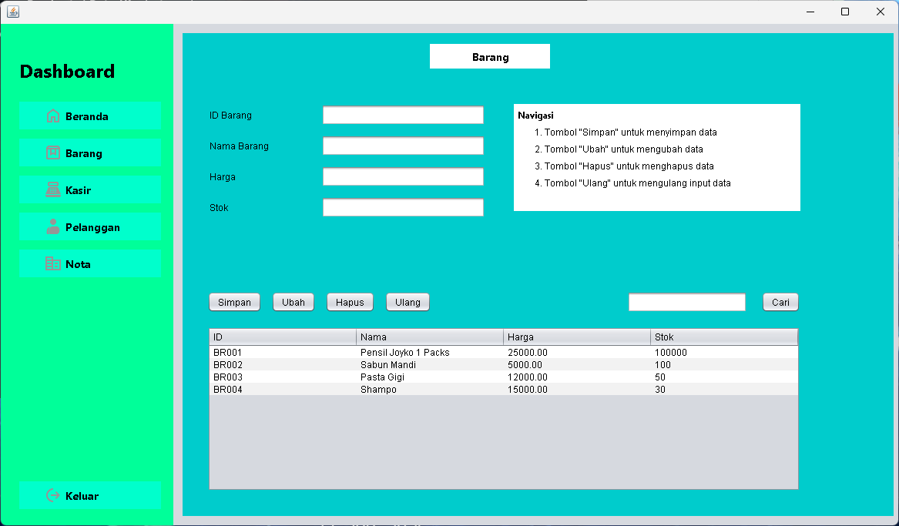

# Tugas Pemrograman Visual - Putri Market

## Daftar Isi

-   [Deskripsi Proyek](#deskripsi-proyek)
-   [Tampilan](#tampilan)
-   [Tampilan Dashboard](#tampilan-dashboard)
-   [Tampilan Barang](#tampilan-barang)
-   [Tampilan Kasir](#tampilan-kasir)
-   [Tampilan Pelanggan](#tampilan-pelanggan)
-   [Tampilan Nota](#tampilan-nota)
-   [Fitur Utama & Fungsi](#fitur-utama--fungsi)
-   [Menu Navigasi](#menu-navigasi)
-   [Struktur Folder](#struktur-folder)
-   [Daftar Aset (Images)](#daftar-aset-images)
-   [Cara Menjalankan](#cara-menjalankan)

## Tampilan

### Tampilan Dashboard

### Tampilan Barang

### Tampilan Kasir

### Tampilan Pelanggan

### Tampilan Nota

## Deskripsi Proyek

Putri Market adalah aplikasi desktop berbasis Java Swing yang digunakan untuk mengelola data toko sederhana. Aplikasi ini memiliki beberapa fitur utama seperti manajemen data barang, kasir, pelanggan, dan nota transaksi. Proyek ini dibuat menggunakan NetBeans IDE dan terhubung ke database menggunakan JDBC.

## Fitur Utama & Fungsi

1. **Login**

    - Autentikasi pengguna sebelum mengakses aplikasi.
    - Hanya pengguna yang terdaftar yang dapat masuk ke sistem.

2. **Dashboard (Beranda)**

    - Menampilkan ringkasan jumlah data: total kasir, pelanggan, barang, dan nota.
    - Setiap panel menampilkan ikon dan jumlah data secara real-time.

3. **Manajemen Barang**

    - Tambah, ubah, hapus, dan cari data barang.
    - Data yang dikelola: ID Barang, Nama Barang, Harga, Stok.
    - Tabel barang untuk melihat seluruh data barang yang tersimpan.

4. **Manajemen Kasir**

    - Tambah, ubah, hapus, dan cari data kasir.
    - Data yang dikelola: ID Kasir, Nama Kasir, No Telepon, Alamat.
    - Tabel kasir untuk melihat seluruh data kasir yang tersimpan.

5. **Manajemen Pelanggan**

    - Tambah, ubah, hapus, dan cari data pelanggan.
    - Data yang dikelola: ID Pelanggan, Nama Pelanggan, No Telepon, Alamat.
    - Tabel pelanggan untuk melihat seluruh data pelanggan yang tersimpan.

6. **Manajemen Nota**

    - Menyimpan, mengubah, menghapus, dan mencari data nota/transaksi.
    - Data yang dikelola: ID Nota, Tanggal, ID Kasir, ID Pelanggan, Total.
    - Tabel nota untuk melihat seluruh transaksi yang tersimpan.

7. **Logout**
    - Keluar dari aplikasi dan kembali ke halaman login.

## Menu Navigasi

-   **Beranda**: Menampilkan dashboard ringkasan data.
-   **Barang**: Menu untuk mengelola data barang.
-   **Kasir**: Menu untuk mengelola data kasir.
-   **Pelanggan**: Menu untuk mengelola data pelanggan.
-   **Nota**: Menu untuk mengelola data transaksi/nota.
-   **Keluar**: Logout dari aplikasi.

## Struktur Folder

-   `src/putrimarket/form/` : Berisi seluruh file form (JFrame/JPanel) aplikasi.
-   `src/putrimarket/koneksi/` : Berisi file koneksi database.
-   `src/putrimarket/images/` : Berisi gambar/icon yang digunakan pada aplikasi.

## Daftar Aset (Images)

Aset gambar yang digunakan pada aplikasi yang digunakan sebagai ikon pada menu atau dashboard:

-   `images/barang.png` : Ikon untuk menu Barang.
-   `images/kasir.png` : Ikon untuk menu Kasir.
-   `images/pelanggan.png` : Ikon untuk menu Pelanggan.
-   `images/nota.png` : Ikon untuk menu Nota/transaksi.
-   `images/logout.png` : Ikon untuk menu Logout.
-   `images/beranda.png` : Ikon untuk menu Beranda/Dashboard.

## Cara Menjalankan

1. Buka project di NetBeans.
2. Pastikan database sudah tersedia dan file koneksi sudah sesuai.
3. Jalankan file `Login.java` untuk memulai aplikasi.
4. Login menggunakan akun yang sudah terdaftar.

---
